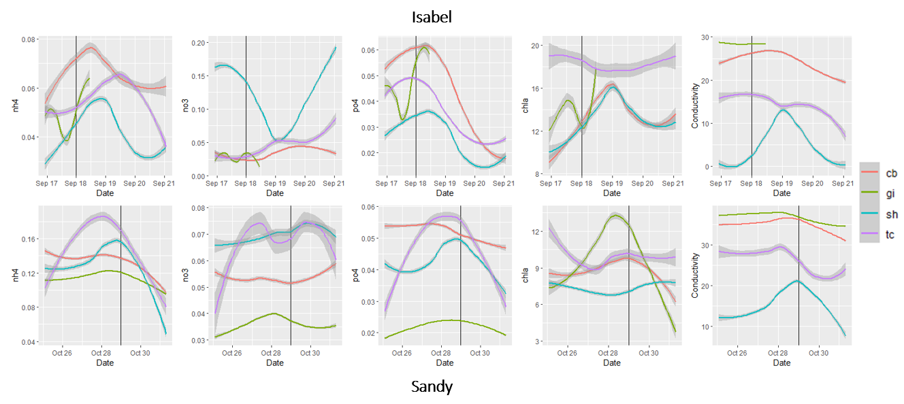
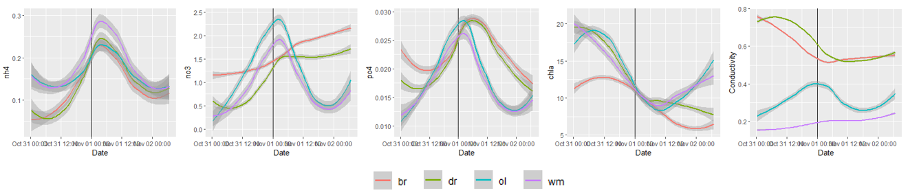
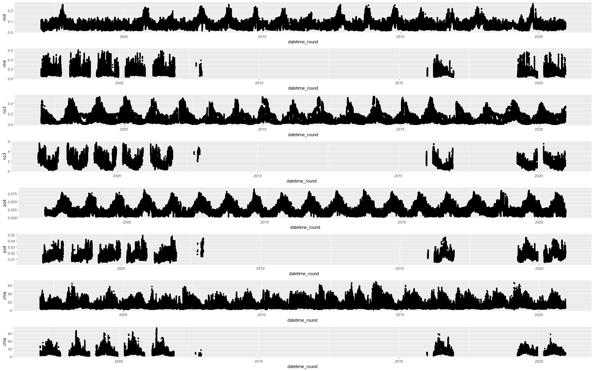

```{r setup, include=FALSE}
# 1. This is the initial set up code and allows for knitr to interpret chunks
  knitr::opts_chunk$set(echo = TRUE)

# 2. Load in packages and necessary source files

  # a) packages
    require(pacman)
    p_load(tidyverse, 
           ggplot2, 
           cowplot, 
           lubridate, 
           tidymodels,
           splitTools, 
           ggthemes, 
           parallel, 
           ggpubr, 
           hydroGOF, 
           kableExtra, 
           grid, 
           gridExtra, 
           DALEXtra, 
           mapview, 
           sf, 
           ggmap)
    
  # b) source files
    # - Functions
      source("Functions/train_Rforest_functions.R") #Training 
      source("Functions/plot_Model_Functions.R") #Ploting 
  
    # - Constants
      source("Constants/initial_model_constants.R")
```

## Introduction

  Coastal ecosystems are invaluable in maintaining environmental and human health, yet, these systems are not well understood. Due to expanding threats from expanding anthropogenic pressures, including pollution, runoff, and climate change, it is important to find the underlying relationships that drive nutrient fluxes to better conserve and protect our waterways. 
  
  Prior to the year 2000, the National Estuarine Research Reserves (NERR) continuously collects nutrient, water quality, and meteorological data from 29 coastal sites around the United States. The estuaries vary by climate, salinity, water chemistry, pollutants, weather events, and geography. This gives an in-depth dataset where we can properly compare how these external features impact these estuaries to see possible comparisons and differences. For this study, we chose to study Old Woman Creek (OWC), a tributary on the west end of Lake Erie, and York River Estuary (CBV), a river on the south end of Chesapeake Bay (Figure 1.)
  
```{r, echo=FALSE, out.width="85%", fig.cap="Figure 1. Data collection sites.", fig.align = 'center'}
knitr::include_graphics("Figs/sites.JPG")
```
  
  OWC is a freshwater estuary located on the edge of Lake Erie. Unlike the typical brackish water of most estuaries, OWC is fresh. The lake water and runoff that drains from the the surrounding area mixes to form a third significantly different body of water in OWC. Lake Erie being the shallowest and running in a East to West position is prone to a weather phenomenon known as seiches. This is from the East to West movement of wind that pushes water up to one side of the lake, sometimes causing several feet of water displacement. In theory this causes drastic mixing and how that plays a role in estuaries like Old Woman Creek is still in need of investigation. 
  
  CBV is a brackish water river that is controlled by tidal fluxes from Chesapeake Bay. The daily tides and runoff forms the varying nutrient levels throughout the river. In recent years, the northeast of the United States has seen a drastic change in the amount of hurricanes in the region. Because of this increase in storm activity, in theory we would see a significant change in water composition due to storm surges and flooding. Our question is how do these storm events compare in evaluating the changing water composition and are there any differences in how salt water and fresh water ecosystems handle this drastic change. 
  
  The data is irregular and variably different between locations. Nutrient data are currently collected via grab-sampling and laboratory analysis, while water quality and climate data are available at high temporal resolution via in-situ sensors. The resulting issue is an inconsistency of available data streams. In order to understand these nutrient fluxes and predict a time-series for general patterns or specific events (e.g. hurricanes and seiches) we utilized random forests to predict nutrient information from the high frequency water data. We chose Breiman's Random Forests because of their ease of utility, ability to handle high dimensional relationships, and their reliability to provide acceptable error in several studies (e.g. ...). 
  
  Random forests are...These studies have been successful in implementing a similar approach...
  
  We predict that we will observe... differences..., yet, similar... at OWC and CBV because of ... environmental features. 
  
  The power of this approach is we can observe specific events and evaluate the impact of the event on nutrient data at a high resolution that would have otherwise been impossible to be tested.

## Methods

Data was collected from each station, preparation for analysis with the programming language R, and merged together with emphasis on maintaining the highest sample size. The highest sample size was our priority because it allows us to obtain the most amount of true values to train and test the random forest models.  

We compared two well known implementations of the random forest architecture: randomForest and ranger. The package randomForest is based on the Brieman's Random Forest implementation, while ranger uses a combination of methodologies to emphasize speed and memory efficiency.  

```{r, echo=FALSE, out.width="85%", fig.cap="Figure 2. Overview of ammonia random forest model training procedure.", fig.align = 'center'}
knitr::include_graphics("Figs/ML methodology.JPG")
```

</br>

To give stronger evidence that we are on the right assumptions we evaluated the correlation between predictors and known nutrient information (Figure 3). 

</br>

```{r, echo=FALSE, out.width="85%", fig.cap="Figure 3. Correlations of original data", fig.align = 'center'}
knitr::include_graphics("Figs/CorrelationPlots HF.png")
```

### Data Collection

### Model Training

  Using random forests, we divided our predictors into water quality and meteorological data as divided up within the NERR data set. Therefore, for each nutrient, we used either set of predictors and both together to determine the error produced by each model. We compared MAE, RMSE and NSE coefficients to observe if there were any significant differences across predictor sets ([SI Figure 1](#feature-selection)).

1. Single line of code to train and get model information needed for analysis and new plots:
```{r trainRFModelOneLine, eval = FALSE}
#Train data on cbv location with random forest
result_cbv_rf <- parApply(cl,reference_table,1, 
                          function(x) choose_inputs(
                            cbv_all, 
                            x[1], 
                            eval(parse(text = x[2])), 
                            x[3], 
                            modelType = "randomForest", 
                            importance = TRUE, 
                            prop = 8/10))
```


2. The steps to Train a model:
```{r trainRFModelMultiLine, eval = FALSE}
# Create model, and return useful things (data, plots, stats)
choose_inputs <- function(all_data, dep, pred, label, importance, prop = 3/4, t = -1, modelType = "ranger", station = "") {
  #Clean and filter data set
  dt_clean <- all_data %>% 
    select(all_of(dep), all_of(pred)) %>% 
    drop_na() %>% 
    rename(actual = all_of(dep))
  
  #Calculate correlations
  correlations <- cor(dt_clean)
  
  dt_split <- splitData(dt_clean, dep, pred, prop)
  
  #Create the train and test data
  dt_train <- training(dt_split)
  dt_test <- testing(dt_split)
  
  # create CV object from training data
  dt_cv <- vfold_cv(dt_train)
  
  #1. Create the Recipe
  dt_recipe <- createRecipe(dt_train, dt_clean)
  
  #2. Specify the Model
  rf_model <- specifyModel(modelType, t, importance)
  
  #3. Create workflow
  rf_workflow <- createWorkflow(dt_recipe, rf_model)
  
  #4. Tune mtry
  rf_workflow <- tuneMtry(rf_workflow, pred, dt_cv, t)
  
  #6. Fit model to train set and validate on test set
  rf_fit <- rf_workflow %>%
    # fit on the training set and evaluate on test set
    last_fit(dt_split)
  
  
  #7. Evaluate model performance
  test_predictions <- rf_fit %>% collect_predictions()
  all_metrics <- evaluateModel(rf_fit, test_predictions)
  
  #8. Build Figure
  Fig <- showEval(test_predictions, label)
  
  #9. Build Final Model
  final_model <- fit(rf_workflow, dt_clean)
  
  
      #(Optional) built explainer to work with DALEX for neural networks 
      explainer_rf<- explain_tidymodels(
        final_model, 
        data = dplyr::select(dt_clean, -actual), 
        y = dt_clean$actual, 
        label = "random forest"
      )
  
  #10. Build importance plots
  importance <- grabTheImportance(final_model, modelType)
  importancePlot <- createImportancePlot(importance, paste0(dep,": ", station))
  
  #Return a list of the ggplot figure, the final fit, the best mtry, 
  #and the mtry at each fold
  Fig_result <- list(Fig, 
                     final_model, 
                     rf_fit, 
                     all_metrics, 
                     correlations, 
                     importancePlot, 
                     explainer_rf)
  
  names(Fig_result) <- c("plot", 
                         "finalModel", 
                         "trainTestModel", 
                         "metrics", 
                         "correlations", 
                         "importancePlot", 
                         "finalModelDT")
  return(Fig_result)
}
```

```{r trainModels, include=FALSE}
#Load in reference table
load("Model/referenceTable.Rdata")

#Load in trained models
load("Model/randomForestOWC.RData")
load("Model/randomForestCBV.RData")
load("Model/rangerOWC.RData")
load("Model/rangerCBV.RData")
```

  When we saw similar error between between the groups, we based our decision on how much data was available when running the model to get predictions ([SI Figure 2](#missing-predictions)). This led to our discovery that for OWC a large portion of data was missing regarding meteorological information. Therefore, we stuck with water quality predictors ([SI Figure 3 & 4](#architecture-selection)). 

## Feature Importance

With random forests, unlike other "black-box" machine learning methods, such as artificial neural networks (ANNs), we can find feature importance in regards to how the model predicted values. This is a big advantage when it comes to when we want to know how significant values are found and give a better understanding of the roles of different features in an ecosystem. 

</br>

> Gini Importance is calculated as the decrease in node impurity weighted by the probability of reaching that node. The node probability can be calculated by the number of samples that reach the node, divided by the total number of samples. The higher the value the more important the feature." - [Stacy Ronaghan](https://towardsdatascience.com/the-mathematics-of-decision-trees-random-forest-and-feature-importance-in-scikit-learn-and-spark-f2861df67e3) 

</br>

```{r, echo=FALSE, out.width="85%", fig.cap="Figure 5. Feature importance as a percentage of gini importance.", fig.align = 'center'}
knitr::include_graphics("Figs/Feature Importance.png")
```

## Nutrient Patterns

Now that we know what features are probably our best indicators for the values we are predicting, we can look at the hourly patterns of our values and see the differences and similarites across our four nutrient values. Additionally, you can find nutrient patterns by the month in the supplemental information ([SI Figure 7 & 8](#monthly-patterns))

```{r, echo=FALSE, out.width="100%", fig.cap="Figure 8. Polar plots of nutrient patterns by the hour", fig.align = 'center'}
knitr::include_graphics("Figs/PatternsByHour.png")
```

## Hurricanes and Tropical Storms

In addition to general patterns we can explore specific events now, where as before we had only a fraction of the amount of nutrient data information. Now, we can observe specific storm events and explore the drivers that influenced nutrient levels to change or stay the same. As we delve deeper in the data, you can see significant events happening. Below are three hurricanes that hit Chesapeake Bay with varying intensity: 

1. Hurricane Isabelle
2. Tropical Storm Melissa
3. Hurricane Irene

```{r, echo=FALSE, out.width="100%", fig.cap="Figure 11. Hurricane events", fig.align = 'center'}

```

## Seiche Events

As opposed to our salt water counterpart in the Chesapeake Bay, Lake Erie does not get these storm systems. Instead, we can look at a strange phenomenon known as a seiche event. A seiche is when a strong west to east wind is prevalent and pushes water up to one side of the lake and recedes from the other. In Lake Erie, it has been reported to cause tidal changes of up to 15 ft. This causes a great mixing of the water both from the physical movement and underwater waves that mix benthic water to the surface. 

Below is what we call a "super seiche." Super seiches are two seche events that happen within 3-4 days of each other. Unlike hurricanes which are well documented, seiches are very commonly confused with tides. Therefore, with little documentation, I found two of these super seiches recorded in public news media. These events both happened at the beginning of November in 2003 and 2019 respectively.  

```{r, echo=FALSE, out.width="100%", fig.cap="Figure 12. Seiche events", fig.align = 'center'}

```

## References

Breiman, L. Random Forests. Machine Learning 45, 5–32 (2001). https://doi.org/10.1023/A:1010933404324

Wright, M.N., and Ziegler, A. ranger: A Fast Implementation of Random Forests for High Deimensional Data in C++ and R. 77, 1 (2017). https://doi.org/10.18637/jss.v077.i01


# Suplemental Information


  
## Feature Selection

```{r plotMetrics, echo = FALSE, fig.cap="SI Figure 1. Table of metrics for decerning the best model.", fig.align='center'}
#Make a chart by chemical signature, predictors, RMSE, MAE and NSE
sumTable <- data.frame()

for(i in 1:nrow(reference_table)){
  sumTable[i,c(1:14)] <- tibble(reference_table[i,c(1,2)]) %>% 
            c(result_cbv_ranger[[i]][[4]][c(2, 4, 9),], 
              result_owc_ranger[[i]][[4]][c(2, 4, 9),], 
              result_cbv_rf[[i]][[4]][c(2, 4, 9),], 
              result_owc_rf[[i]][[4]][c(2, 4, 9),])  %>%
            data.frame() %>% 
            mutate(predictor = strsplit(predictor, "_")[[1]][1])
}

colnames(sumTable) <- c("Signal", "Predictor", "MAE", "RMSE", "NSE", "MAE", "RMSE", "NSE", "MAE", "RMSE", "NSE", "MAE", "RMSE", "NSE")
kable(sumTable, caption="Table 1. Metrics of mean average error (MAE), root mean square error (RMSE), and Nash-Sutcliffe model efficiency coefficient (NSE). Across the two locations of Cheasepeak Bay (cbv) and Old Woman Creek (owc) and the different signatures of ammonia, nitrate, phosphate, and chlorophyll a, the randomForest package out-performs ranger.") %>%
  add_header_above(c(" " = 2, "CBV" = 3, "OWC" = 3, "CBV" = 3, "OWC" = 3)) %>% 
  add_header_above(c(" " = 2, "ranger" = 6, "randomForest" = 6)) %>% 
  kable_classic() %>% 
  column_spec(c(3:5, 9:11), 
              background = "#d3d3d3") %>% 
  kable_styling(latex_options="scale_down")

```

## Missing Predictions

```{r, echo=FALSE, out.width="85%", fig.cap="SI Figure 2. High frequency predictions", fig.align = 'center'}

```


## Architecture Selection
  
```{r modelPerformance, echo = FALSE, fig.cap="SI Figure 3. Table of metrics for water quality predictors", fig.align='center'}

#Make a chart by chemical signature, predictors, RMSE, MAE and NSE
sumTable <- data.frame()

#1. Extract metrics from model list
for(i in 1:nrow(reference_table)){
sumTable[i,c(1:14)] <- tibble(reference_table[i,c(1,2)]) %>% 
  c(result_cbv_ranger[[i]]$metrics[c(2, 4, 9),])  %>%
  c(result_owc_ranger[[i]]$metrics[c(2, 4, 9),]) %>% 
  c(result_cbv_rf[[i]]$metrics[c(2, 4, 9),])  %>%
  c(result_owc_rf[[i]]$metrics[c(2, 4, 9),]) %>% 
  data.frame() %>% 
  mutate(predictor = strsplit(predictor, "_")[[1]][1])
}

  #2. Filter just wq metrics
wqTable <- sumTable[wq_ind,]
colnames(wqTable) <- c("Signal", "Predictor", rep(c("MAE", "RMSE", "NSE"), 4))

kable(wqTable, caption="Table 2. Water Quality metrics of mean average error (MAE), root mean square error (RMSE), and Nash-Sutcliffe model efficiency coefficient (NSE). Across the two locations of Cheasepeak Bay (cbv) and Old Woman Creek (owc) and the different signatures of ammonia, nitrate, phosphate, and chlorophyll a, the randomForest package out-performs ranger.") %>%  
  remove_column(1) %>% 
  add_header_above(c(" " = 2, "CBV" = 3, "OWC" = 3, "CBV" = 3, "OWC" = 3)) %>% 
  add_header_above(c(" " = 2, "ranger" = 6, "randomForest" = 6)) %>% 
  kable_classic() %>% 
  column_spec(c(3:5, 9:11), 
              background = "lightgrey")%>% 
  kable_styling(latex_options="scale_down")

```


## Model Performance

```{r, echo=FALSE, out.width="85%", fig.cap="SI Figure 4. Actual versus predicted plots", fig.align = 'center'}

```

## Partial Dependency Plots

```{r, echo=FALSE, out.width="85%", fig.cap="SI Figure 5. Partial dependency plots", fig.align = 'center'}
knitr::include_graphics("Figs/pdp.png")
```


## Monthly Patterns

....Construction Zone ... 

```{r, echo=FALSE, out.width="85%", fig.cap="SI Figure 6. CBV nutrient patterns by month", fig.align = 'center'}
knitr::include_graphics("Figs/PatternsByMonthCBV.png")
```

```{r, echo=FALSE, out.width="85%", fig.cap="SI Figure 7. OWC nutrient patterns by month", fig.align = 'center'}
knitr::include_graphics("Figs/PatternsByMonthOWC.png")
```