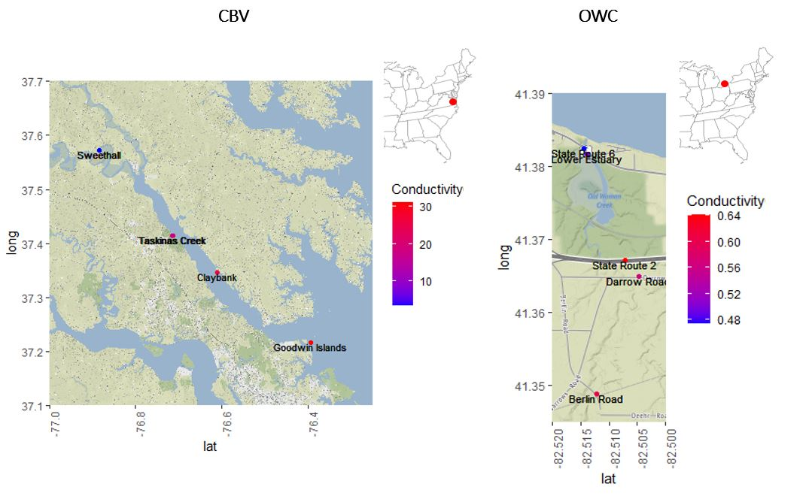

```{r setup, include=FALSE}
# 1. This is the initial set up code and allows for knitr to interpret chunks
  knitr::opts_chunk$set(echo = TRUE)

# 2. Load in packages and necessary source files

  # a) packages
    require(pacman)
    p_load(tidyverse, 
           ggplot2, 
           cowplot, 
           lubridate, 
           tidymodels,
           splitTools, 
           ggthemes, 
           parallel, 
           ggpubr, 
           hydroGOF, 
           kableExtra, 
           grid, 
           gridExtra, 
           DALEXtra, 
           mapview, 
           sf, 
           ggmap)
    
  # b) source files
    # - Functions
      source("Functions/train_Rforest_functions.R") #Training 
      source("Functions/plot_Model_Functions.R") #Ploting 
  
    # - Constants
      source("Constants/initial_model_constants.R")
```

## Introduction

  Coastal ecosystems are invaluable in maintaining environmental and human health, yet, these systems are not well understood. Due to expanding threats from expanding anthropogenic pressures, including pollution, runoff, and climate change, it is important to find the underlying relationships that drive nutrient fluxes to better conserve and protect our waterways. 
  
  Prior to the year 2000, the National Estuarine Research Reserves (NERR) continuously collects nutrient, water quality, and meteorological data from 29 coastal sites around the United States. The estuaries vary by climate, salinity, water chemistry, pollutants, weather events, and geography. This gives an in-depth dataset where we can properly compare how these external features impact these estuaries to see possible comparisons and differences. For this study, we chose to study Old Woman Creek (OWC), a tributary on the west end of Lake Erie, and York River Estuary (CBV), a river on the south end of Chesapeake Bay (Figure 1.)
  
```{r, echo=FALSE, out.width="85%", fig.cap="Figure 1. Data collection sites.", fig.align = 'center'}

```
  
  OWC is a freshwater estuary located on the edge of Lake Erie. Unlike the typical brackish water of most estuaries, OWC is fresh. The lake water and runoff that drains from the the surrounding area mixes to form a third significantly different body of water in OWC. Lake Erie being the shallowest and running in a East to West position is prone to a weather phenomenon known as seiches. This is from the East to West movement of wind that pushes water up to one side of the lake, sometimes causing several feet of water displacement. In theory this causes drastic mixing and how that plays a role in estuaries like Old Woman Creek is still in need of investigation. 
  
  CBV is a brackish water river that is controlled by tidal fluxes from Chesapeake Bay. The daily tides and runoff forms the varying nutrient levels throughout the river. In recent years, the northeast of the United States has seen a drastic change in the amount of hurricanes in the region. Because of this increase in storm activity, in theory we would see a significant change in water composition due to storm surges and flooding. Our question is how do these storm events compare in evaluating the changing water composition and are there any differences in how salt water and fresh water ecosystems handle this drastic change. 
  
  The data is irregular and variably different between locations. Additionally, nutrient data is not collected with the high frequency (approximately 15 minutes) like meteorological and water quality data. In order to understand these nutrient fluxes and predict a time-series for general patterns or specific events (e.g. hurricanes and seiches) we will need to implement some form of  machine learning architecture. We chose Breiman's Random Forests because of their ease of utility, ability to handle high dimensional relationships, and provide acceptable error in several studies (e.g. ...). 
  
  Random forests are...These studies have been successful in implementing a similar approach...
  
  We predict that we will observe... differences..., yet, similar... at OWC and CBV because of ... environmental features. 
  
  The power of this approach is we can observe specific events and evaluate the impact of the event on nutrient data at a high resolution that would have otherwise been impossible to be tested.

## Methods

Data was collected from each station, preparation for analysis with the programming language R, and merged together with emphasis on maintaining the highest sample size. The highest sample size was our priority because it allows us to obtain the most amount of true values to train and test the random forest models.  

We compared two well known implementations of the random forest architecture: randomForest and ranger. 

```{r, echo=FALSE, out.width="85%", fig.cap="Figure 2. Overview of ammonia random forest model training procedure.", fig.align = 'center'}

```

To give stronger evidence that we are on the right assumptions we evaluated the correlation between predictors and known nutrient information (Figure 3). 

```{r, echo=FALSE, out.width="85%", fig.cap="Figure 3. Correlations against high frequency data", fig.align = 'center'}
knitr::include_graphics("Figs/CorrelationPlots HF.png")
```


### Data Collection

### Model Training

  Using random forests, we divided our predictors into water quality and meteorological data as divided up within the NERR data set. Therefore, for each nutrient, we used either set of predictors and both together to determine the error produced by each model. We compared MAE, RMSE and NSE coefficients to observe if there were any significant differences across predictor sets.

```{r trainModels, include=FALSE}
#Load in reference table
load("Model/referenceTable.Rdata")

#Load in trained models
load("Model/randomForestOWC.RData")
load("Model/randomForestCBV.RData")
load("Model/rangerOWC.RData")
load("Model/rangerCBV.RData")
```


  
### Feature Selection

```{r plotMetrics, echo = FALSE, fig.cap="Figure 2. Overview of ammonia random forest model training procedure.", fig.align='center'}
#Make a chart by chemical signature, predictors, RMSE, MAE and NSE
sumTable <- data.frame()

for(i in 1:nrow(reference_table)){
  sumTable[i,c(1:14)] <- tibble(reference_table[i,c(1,2)]) %>% 
            c(result_cbv_ranger[[i]][[4]][c(2, 4, 9),], 
              result_owc_ranger[[i]][[4]][c(2, 4, 9),], 
              result_cbv_rf[[i]][[4]][c(2, 4, 9),], 
              result_owc_rf[[i]][[4]][c(2, 4, 9),])  %>%
            data.frame() %>% 
            mutate(predictor = strsplit(predictor, "_")[[1]][1])
}

colnames(sumTable) <- c("Signal", "Predictor", "MAE", "RMSE", "NSE", "MAE", "RMSE", "NSE", "MAE", "RMSE", "NSE", "MAE", "RMSE", "NSE")
kable(sumTable, caption="Table 1. Metrics of mean average error (MAE), root mean square error (RMSE), and Nash-Sutcliffe model efficiency coefficient (NSE). Across the two locations of Cheasepeak Bay (cbv) and Old Woman Creek (owc) and the different signatures of ammonia, nitrate, phosphate, and chlorophyll a, the randomForest package out-performs ranger.") %>%
  add_header_above(c(" " = 2, "CBV" = 3, "OWC" = 3, "CBV" = 3, "OWC" = 3)) %>% 
  add_header_above(c(" " = 2, "ranger" = 6, "randomForest" = 6)) %>% 
  kable_classic() %>% 
  column_spec(c(3:5, 9:11), 
              background = "#d3d3d3") %>% 
  kable_styling(latex_options="scale_down")

```

### Architecture Selection
  
```{r modelPerformance, echo = FALSE}
#Make a chart by chemical signature, predictors, RMSE, MAE and NSE
sumTable <- data.frame()

#1. Extract metrics from model list
for(i in 1:nrow(reference_table)){
sumTable[i,c(1:14)] <- tibble(reference_table[i,c(1,2)]) %>% 
  c(result_cbv_ranger[[i]]$metrics[c(2, 4, 9),])  %>%
  c(result_owc_ranger[[i]]$metrics[c(2, 4, 9),]) %>% 
  c(result_cbv_rf[[i]]$metrics[c(2, 4, 9),])  %>%
  c(result_owc_rf[[i]]$metrics[c(2, 4, 9),]) %>% 
  data.frame() %>% 
  mutate(predictor = strsplit(predictor, "_")[[1]][1])
}

  #2. Filter just wq metrics
wqTable <- sumTable[wq_ind,]
colnames(wqTable) <- c("Signal", "Predictor", rep(c("MAE", "RMSE", "NSE"), 4))

kable(wqTable, caption="Table 2. Water Quality metrics of mean average error (MAE), root mean square error (RMSE), and Nash-Sutcliffe model efficiency coefficient (NSE). Across the two locations of Cheasepeak Bay (cbv) and Old Woman Creek (owc) and the different signatures of ammonia, nitrate, phosphate, and chlorophyll a, the randomForest package out-performs ranger.") %>%  
  remove_column(1) %>% 
  add_header_above(c(" " = 2, "CBV" = 3, "OWC" = 3, "CBV" = 3, "OWC" = 3)) %>% 
  add_header_above(c(" " = 2, "ranger" = 6, "randomForest" = 6)) %>% 
  kable_classic() %>% 
  column_spec(c(3:5, 9:11), 
              background = "lightgrey")%>% 
  kable_styling(latex_options="scale_down")

```

## Model Performance

```{r, echo=FALSE, out.width="85%", fig.cap="Figure 3. Actual versus predicted plots", fig.align = 'center'}
knitr::include_graphics("Figs/Model Performance.png")
```

## Missing Predictions

```{r, echo=FALSE, out.width="85%", fig.cap="Figure 4. High frequency predictions", fig.align = 'center'}
knitr::include_graphics("Figs/HF_wqPredictions.png")
```

## Feature Importance

```{r, echo=FALSE, out.width="85%", fig.cap="Figure 5. Feature importance", fig.align = 'center'}
knitr::include_graphics("Figs/Feature Importance.png")
```


## Partial Dependency Plots

```{r, echo=FALSE, out.width="85%", fig.cap="Figure 7. Partial dependency plots", fig.align = 'center'}
knitr::include_graphics("Figs/pdp.png")
```

## Nutrient Patterns

```{r, echo=FALSE, out.width="50%", fig.cap="Figure 8. Nutrient patterns by the hour", fig.align = 'center'}

```

```{r, echo=FALSE, out.width="85%", fig.cap="Figure 9. CBV nutrient patterns by month", fig.align = 'center'}
knitr::include_graphics("Figs/PatternsByMonthCBV.png")
```

```{r, echo=FALSE, out.width="85%", fig.cap="Figure 10. OWC nutrient patterns by month", fig.align = 'center'}
knitr::include_graphics("Figs/PatternsByMonthOWC.png")
```

## Hurricanes and Tropical Storms

```{r, echo=FALSE, out.width="85%", fig.cap="Figure 11. Hurricane events", fig.align = 'center'}
knitr::include_graphics("Figs/Hurricane Events.png")
```

## Seiche Events

```{r, echo=FALSE, out.width="85%", fig.cap="Figure 12. Seiche events", fig.align = 'center'}
knitr::include_graphics("Figs/Seiche Events.png")
```

## References

Breiman, L. Random Forests. Machine Learning 45, 5–32 (2001). https://doi.org/10.1023/A:1010933404324

